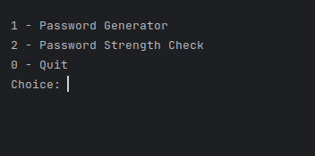
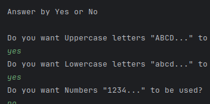
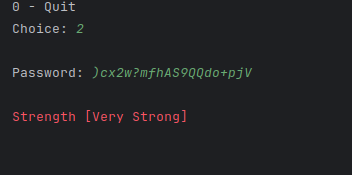
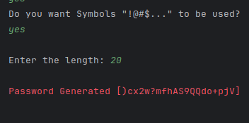

## Showcase 🔭

|                                         |                                            |
|               :---:                     |                 :---:                      |
|             |           |
|          |       |

## Why to Open Source 🌐

1. **Community Collaboration**: Open sourcing your project invites a global community of developers to contribute, share ideas, and enhance its capabilities.

2. **Accelerated Development**: With a collective effort, open source projects progress faster, benefiting from diverse skill sets and constant feedback.

3. **Transparency and Trust**: Open source builds trust by allowing users to inspect code, ensuring security and transparency in software.

4. **Cost Efficiency**: It reduces development costs as contributors volunteer their time and resources, making it an economical choice.

5. **Longevity**: Open source projects tend to have longer lifespans, as they are not reliant on a single entity, ensuring sustainability.
